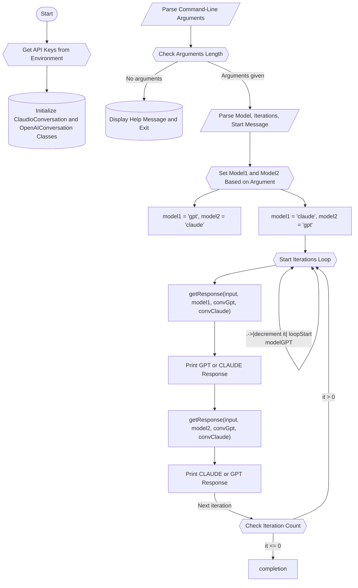

# dAIlectics
# Dialogue Manager: Claude and OpenAI Integration

This project provides a tool to manage a conversation between the Claude AI model from Anthropic and the GPT model from OpenAI. It utilizes environment variables to securely access the APIs for both services.

## Features

- Initiate a dialogue with either Claude or OpenAI's GPT model
- Maintain conversation history for context-aware responses
- Flexible command-line interface for easy operation

## Prerequisites

Before running this script, make sure you have:

- Python 3 installed on your system
- Access to the internet to use the AI APIs
- API keys for both OpenAI and Claude, set as environment variables `OPENAI_API_KEY` and `CLAUDE_API_KEY`

## Installation

To set up and run the script, follow these steps:

1. Install the `openai` and `anthropic` Python packages (or equivalent):
    ```bash
    pip install openai
    pip install anthropic  # Substitute with the appropriate package for Claude
    ```

2. Export your API keys as environment variables:
    ```bash
    export OPENAI_API_KEY='your_openai_api_key'
    export CLAUDE_API_KEY='your_claude_api_key'
    ```

## Usage

Run the script using the following command-line syntax:

```bash
python dAIlectic.py -m [model] -i [iterations] -s "[start_message]"
```

Arguments:

- `-m`, `--model`: The type of model to start the conversation (`claude` or `gpt`)
- `-i`, `--iterations`: Number of iterations for the conversation
- `-s`, `--start`: The starting message for the conversation

Example:

```bash
python dAIlectic.py -m gpt -i 5 -s "Hello, how are you?"
```

## Functionality Breakdown

### ClaudioConversation Class

Handles conversations with the Claude model by managing the conversation history and using the Anthropic API client.

Methods include:

- `add_message(role, content)`: Adds a message to the conversation history.
- `get_conversation_history()`: Returns the current conversation history.
- `clear_history()`: Clears the entire conversation history.
- `truncate_history()`: Truncates the history if it exceeds the max token limit.
- `send_message(user_input)`: Sends a message to Claude and returns the response.

### OpenAIConversation Class

Manages interactions with the OpenAI GPT model in a similar fashion to the `ClaudioConversation` class.

### getResponse Function

Determines which model to use based on user input, interacts with the appropriate conversation handler, and prints the responses.

### main Function

Parses command-line arguments and manages the overall process, including initializing conversation handlers and controlling the flow of messages between models.

## Conclusion

This script demonstrates an implementation for managing dialogues between two advanced AI models using Python. Adapt and update it as necessary to fit the specific requirements of your application and the particularities of the AI platforms' APIs.


